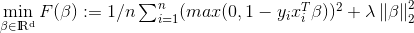
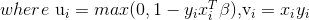

# Linear Support Vector Machine With the Squared Hinge Loss

The loss function for linear support vector machine with the squared hinge loss is

 

Thus the gradient of the loss function can be written as

 

- Statistical Machine Learning For Data Scientists Code Release Practice

- In this repo, I implemented in Python an algorithm of linear support vector machine with the squared hinge loss.

**There are two demos and one function py file in this repo:**

**SVM_spam_data_demo.ipynb**

Run this file in jupyter notebook, users can launch the method on spam dataset, visualize the training process, and print the performance.
-	Spam dataset: https://statweb.stanford.edu/~tibs/ElemStatLearn/datasets/spam.data
-	Test_indicator: https://statweb.stanford.edu/~tibs/ElemStatLearn/datasets/spam.traintest

**SVM_simulated_data_demo.ipynb**

Run this file in jupyter notebook, users can launch the method on a simple simulated dataset,
visualize the training process, and print the performance.

**svm_hingeloss.py**

Users can run an experimental comparison between my implementation and scikit-learn’s on either a simulated or real-world dataset of their choice.

